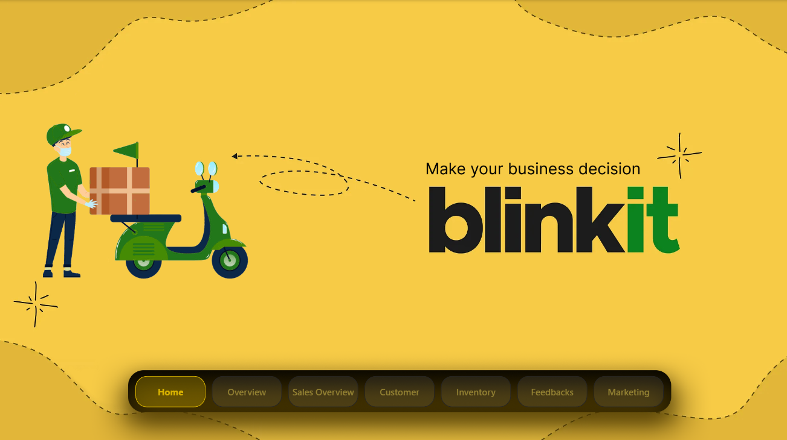
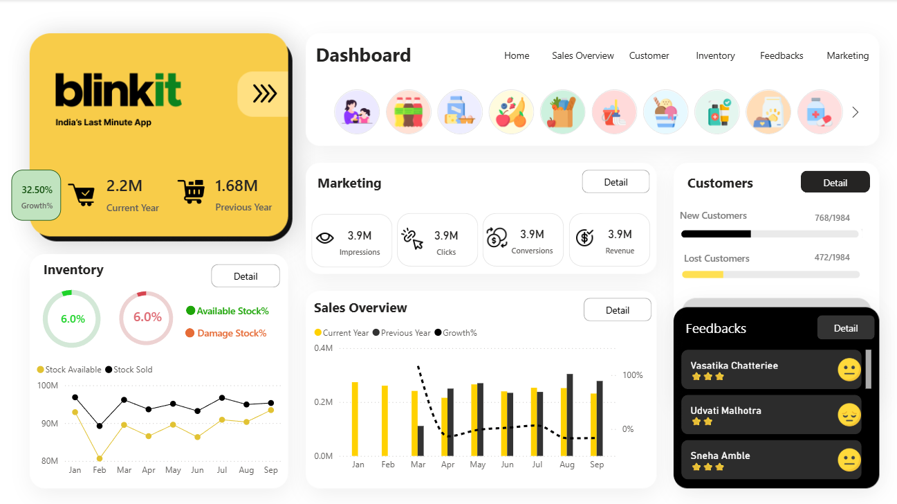
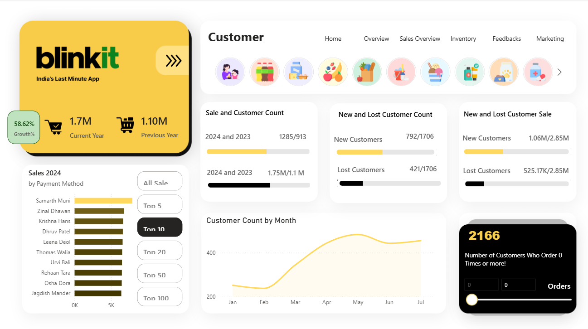
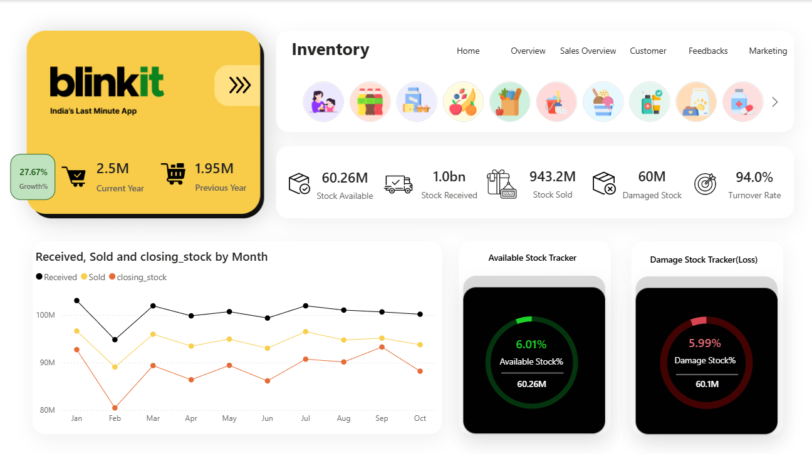
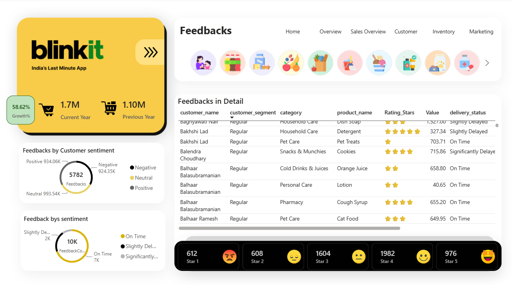
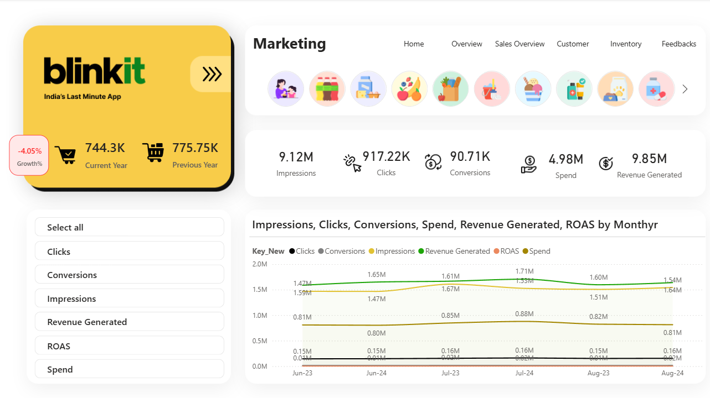

# 🚀 Blinkit Quick-Commerce Analytics Dashboard

An end-to-end, multi-page Power BI business intelligence solution designed to analyze order fulfillment logistics, sales seasonality, stock turnover, customer retention, and marketing efficiency for Blinkit, a leading quick-commerce platform.

This project transforms high-volume operational data into interactive, actionable visual insights using SQL, Power Query (M), and advanced DAX modeling.

---

---

## 📊 Executive Summary

In quick-commerce platforms like Blinkit, operating at minute-level SLAs requires centralized data visibility. Managing order delays, inventory stockouts, regional demand surges, and customer churn can be overwhelming without unified reporting tools.

This project delivers a 7-page interactive dashboard containing over 300+ custom visuals, providing cross-functional analytics for executive leaders, dark-store operational managers, and performance marketing teams.

### Project Scale at a Glance
* Total Pages: 7 Interactive Report Pages
* Visual Elements: 300+ (KPI Cards, Heatmaps, Trend Lines, Slicers, Tooltips)
* Data Sources: SQL Database, Structured CSV/Excel Files
* Key Analytical Domains: Order Logistics, Regional Revenue Split, Customer LTV, Inventory Turnover Ratio, Sentiment Analysis, Marketing ROI.

## 🛠️ Technical Stack

* Business Intelligence: Power BI Desktop
* Data Warehousing & Querying: SQL, MS Excel / CSV
* ETL & Data Cleaning: Power Query (M Language)
* Data Modeling & Analytics: DAX (Data Analysis Expressions)
* UI/UX Design: Canvas backgrounds, custom visual hierarchy, dynamic page navigation

---

## 🧮 Calculated Measures (DAX Snippets)

Representative DAX formulas used across the report for dynamic metrics:

### Delivery Completion Rate (%)
Delivery Completion Rate = 
DIVIDE(
    CALCULATE(COUNT(Fact_Orders[Order_ID]), Fact_Orders[Status] = "Delivered"),
    COUNT(Fact_Orders[Order_ID]),
    0
)

### Average Order Value (AOV)
Average Order Value = 
DIVIDE([Total Revenue], [Total Orders], 0)

### Inventory Turnover Ratio
Inventory Turnover Ratio = 
DIVIDE([COGS], AVERAGE(Fact_Inventory[Stock_Value]), 0)

### Customer Retention Rate (%)
Customer Retention Rate = 
DIVIDE(
    CALCULATE(DISTINCTCOUNT(Fact_Orders[Customer_ID]), Fact_Orders[Is_Repeat_Customer] = TRUE()),
    DISTINCTCOUNT(Fact_Orders[Customer_ID]),
    0
)

---

## 🖼️ Page-by-Page Visual Analysis

### 1. Home / Landing Page
Central navigation landing page linking all operational reporting pages with custom dynamic visuals.

### 2. Overview Page
Macro-level performance summary displaying total orders, delivery completion rates, and regional revenue breakdown.

### 3. Sales Overview Page
Tracks revenue performance across product categories, monthly sales seasonality, and Average Order Value (AOV) growth.

### 4. Customer Analytics Page
Monitors repeat order metrics, customer acquisition channels, and top revenue-generating customers.

### 5. Inventory Management Page
Features stock level heatmaps, turnover ratios, and automated low-stock warnings to avoid dark-store stockouts.

### 6. Feedbacks & Sentiment Page
Categorizes qualitative customer feedback (Positive, Neutral, Negative) and highlights common sentiment keywords.

### 7. Marketing ROI Page
Evaluates ad spend performance across acquisition channels (Social, Search, Email) and compares campaign ROI.

---

## 💡 Business Impact & Recommendations

1. Logistics Optimization: High-volume bottlenecks occur between 7 PM and 10 PM. Reallocating delivery partner shifts during peak evening hours reduces delayed delivery rates.
2. Stockout Prevention: Low-stock alerts flagged fast-moving dairy and snack SKUs early, improving dark-store replenishment efficiency.
3. Marketing Efficiency: Referral and Organic acquisition channels delivered higher ROI compared to paid social ads, pointing to potential ad-budget reallocation opportunities.

---

## ⚙️ Setup & Installation

1. Clone the repository:
   git clone https://github.com/Aditya66050177/blinkit-quick-commerce-dashboard.git

2. Download & View Dashboard:
   - Open Blinkit Dashboard - V1.pbix directly using Power BI Desktop.

---

## 🤝 Author & Contact

Aditya M Patil
* LinkedIn: https://linkedin.com/in/your-profile
* GitHub: https://github.com/Aditya66050177
